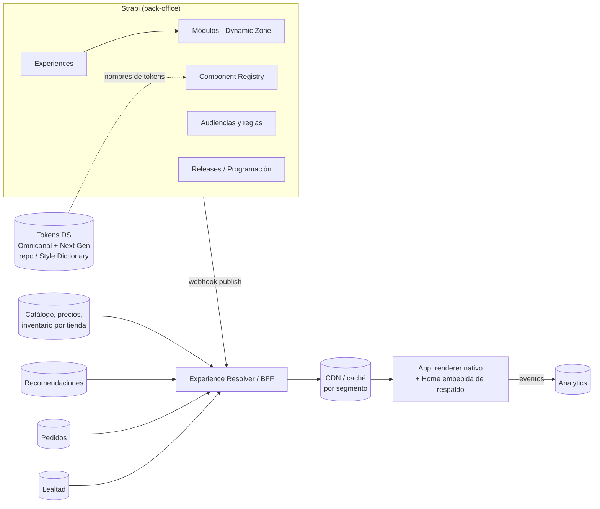

# PRD · Experience Studio sobre Strapi

**Home server-driven de la app Chedraui (Next Gen)**

|  |  |
| --- | --- |
| Estado | Borrador v0.1 · para revisión con Producto, Ingeniería Móvil, Backend y Marketing Digital |
| Owner | Product & UX Design · Canales Digitales |
| Fecha | 25 sep 2026 |
| Referencia | Prototipo "Retail Experience OS" (Lovable), DS Omnicanal + capa Next Gen |
| Decisión que pide este documento | Aprobar Fase 0 (validación, 4 semanas) antes de comprometer construcción |

> Copia de trabajo del PRD original. Los cambios propuestos por la alfa están en [`revision-producto.md`](revision-producto.md); este archivo no se edita sin pasar por el registro de decisiones (§23).

---

## 0. Resumen

Queremos que Marketing Digital y Comercial cambien la Home de la app (orden de módulos, campañas, segmentación por cliente, tienda y modalidad) sin esperar un release en App Store / Play Store.

La propuesta: Strapi como back-office de composición, un servicio **Experience Resolver** que arma la Home final para cada cliente, y un renderer nativo en la app que solo pinta componentes certificados del Design System.

Strapi guarda **qué** se quiere mostrar y **bajo qué reglas**. El Resolver decide **qué ve cada cliente** con datos de inventario, tienda, modalidad y versión de app. La app decide **cómo se pinta**, con tokens del DS.

Este PRD no aprueba construir. Aprueba una Fase 0 de 4 semanas que responde dos preguntas: ¿hay suficiente demanda de cambios para justificarlo?, y ¿la app puede renderizar 3 componentes desde JSON con fallback seguro?

---

## 1. Problema

### 1.1 Enunciado

Cambiar la Home de la app requiere desarrollo y un release. Suponemos que eso genera: campañas que salen tarde o no salen, Home idéntica para todos los clientes y tiendas, y un equipo móvil ocupado en cambios de contenido.

### 1.2 Evidencia disponible

**No tenemos datos todavía.** Todo lo anterior es hipótesis. Datos que faltan y cómo obtenerlos:

| Dato | Cómo obtenerlo | Esfuerzo |
| --- | --- | --- |
| Cambios a Home solicitados por mes (últimos 3 meses) | Auditoría de tickets Jira / solicitudes de Marketing | 2 días |
| Lead time solicitud → producción | Mismos tickets, fecha de alta vs fecha de release | incluido |
| % de cambios que requirieron release vs config remota | Clasificar cada ticket | incluido |
| CTR y add-to-cart por módulo de la Home actual | Analytics actual; si no hay eventos por módulo, se instrumenta primero | 1 sprint |
| % de clics desde Home que llegan a producto sin stock o sin la modalidad elegida | Join de eventos de clic con disponibilidad por tienda | 3–5 días de data |

### 1.3 Hipótesis

- **H1 (demanda):** más de 8 cambios por mes a la Home requieren release, con lead time mayor a 10 días. *Umbral propuesto; ajustar con el equipo.*
- **H2 (valor):** una Home segmentada por tienda y modalidad sube el add-to-cart desde Home frente a la Home única.
- **H3 (viabilidad):** la app puede renderizar componentes desde JSON con desempeño equivalente a la Home actual (tiempo a primer contenido útil no peor que hoy).

### 1.4 Alternativa más simple que hay que descartar primero

Si la auditoría muestra que la mayoría de solicitudes son banners y fechas de campaña, basta con **slots fijos administrables** (Hero, Promo, Carrusel curado) en un layout fijo + Remote Config. Cuesta una fracción y no requiere renderer genérico.

**Regla de decisión:** si más del 70% de los cambios caben en slots fijos, se construye la versión de slots y este PRD se archiva.

---

## 2. Objetivos y no-objetivos

### Objetivos (MVP)

1. Publicar cambios de Home sin release, con aprobación y rollback.
2. Programar campañas con inicio y fin automáticos.
3. Segmentar por audiencia, tienda / zona y modalidad (Súper Veloz, Pickup, Envío programado).
4. Garantizar que ninguna versión de app reciba un componente que no sabe pintar.
5. Medir cada módulo con eventos atribuibles a una versión de experiencia.

### No-objetivos (MVP)

- Búsqueda, PLP y PDP server-driven.
- Experimentos A/B nativos en el Studio (se usa la herramienta de experimentación existente, alimentada con `experience_version`).
- Retail Media / subasta de espacios.
- Editar tokens del Design System desde Strapi.
- Construir una plataforma genérica "multi-retailer". El prototipo de Lovable apunta ahí; este PRD lo descarta explícitamente para el MVP.

---

## 3. Usuarios

### 3.1 Usuarios del Studio (internos)

| Rol | Necesita | Frustración hoy (supuesta, validar) | Nivel técnico |
| --- | --- | --- | --- |
| Editor de Marketing Digital | Subir campaña, ordenar módulos, programar fechas | Depende de dev y del calendario de releases | Bajo–medio. No escribe expresiones tipo `user.orderCount = 0` |
| Comercial / Categorías | Destacar surtido y promos por tienda o zona | Home igual en todo el país | Bajo |
| Aprobador (Líder de canal) | Revisar qué cambia antes de producción | No ve el resultado final antes de publicar | Bajo |
| DS / Product Design | Certificar componentes, versionar contrato | Componentes usados fuera de regla | Alto |
| Dev móvil y backend | Contrato estable, fallbacks, observabilidad | Cambios de contenido disfrazados de features | Alto |

### 3.2 Cliente final (app)

Base con alfabetización digital muy diversa. Dos modos de compra:

- **Recurrente:** repone lo de siempre. Necesita Volver a comprar, listas, estado de pedido.
- **Misión:** busca algo concreto ya. Necesita búsqueda al frente y cero ruido.

La Home debe servir a ambos sin crecer a 13 módulos. Límite propuesto: **máximo 8 módulos visibles** por experiencia.

---

## 4. Principios de producto

1. **El editor compone, el sistema garantiza.** Ninguna combinación posible en Strapi puede romper el layout, el grid o la accesibilidad.
2. **Solo componentes certificados.** Si no está en el registro con estado `certified`, no se puede agregar.
3. **Nunca mostrar lo que no se puede comprar.** Módulos de producto filtran por disponibilidad en tienda y modalidad del cliente.
4. **Siempre hay una Home.** Si todo falla, la app pinta la última experiencia válida en caché o la Home embebida.
5. **Reglas en lenguaje humano.** "Solo clientes sin pedidos", nunca `orderCount = 0` en la UI del editor.
6. **Todo cambio es reversible en un clic.**

---

## 5. Arquitectura



### 5.1 Responsabilidades

| Capa | Hace | No hace |
| --- | --- | --- |
| **Strapi** | Modelo de contenido, borradores, aprobación, programación, historial, permisos | Llamadas a inventario o personalización en tiempo real. La app **nunca** consulta Strapi directo |
| **Experience Resolver (BFF)** | Evalúa reglas de audiencia, tienda, modalidad y versión de app; hidrata módulos con datos; deduplica SKUs entre carruseles; aplica fallbacks | Guardar contenido editorial |
| **CDN** | Cachea la parte no personalizada por segmento (tienda × modalidad × audiencia × versión de contrato) | Personalización 1:1 |
| **App** | Pinta componentes por `type` + `version`, aplica tokens, reporta eventos y errores de render | Lógica de negocio de elegibilidad |

### 5.2 Por qué un Resolver separado

Strapi no está pensado para servir millones de requests personalizados con datos de inventario por tienda. Separar el Resolver permite escalar la lectura independiente del CMS, cambiar de CMS sin tocar la app, y probar la lógica de elegibilidad con tests unitarios.

### 5.3 Tokens

Los tokens **no se editan en Strapi.** Viven en el repo del DS (Omnicanal como base, Next Gen como capa) y se distribuyen a la app con Style Dictionary o equivalente. Strapi solo guarda **nombres** de tokens como enumeraciones (`spacing: s | m | l`, `surface: primary | secondary`). Así un editor no puede meter `#FF0000` ni un gap de 15px.

---

## 6. Modelo de contenido en Strapi (v5)

### 6.1 Collection Type: `experience`

| Campo | Tipo Strapi | Reglas |
| --- | --- | --- |
| `name` | Text | Requerido. Ej. "Home · Recurrente · CDMX" |
| `screen` | Enumeration | MVP: `home` |
| `audience` | Relation → `audience` | Requerido. Una experiencia = una audiencia |
| `storeScope` | Relation → `store-segment` (many) | Vacío = nacional |
| `modalities` | Enumeration (multi vía JSON o componente) | `super_veloz`, `pickup`, `envio_programado`, `todas` |
| `priority` | Integer | Resuelve empates cuando un cliente califica a varias experiencias. Mayor gana |
| `modules` | **Dynamic Zone** | Solo componentes `module.*` registrados. Máx. 8 visibles |
| `minContractVersion` | Text (semver) | Calculado al guardar = máximo de los módulos |
| `startsAt` / `endsAt` | Datetime | Opcional. Si no hay `endsAt`, es experiencia base |
| `isFallback` | Boolean | Exactamente una experiencia base nacional con `true` |
| `notes` | Rich text | Contexto para el aprobador |

Draft & Publish activo. Content History (Growth) para diff y rollback.

### 6.2 Componentes de la Dynamic Zone (`module.*`)

Cada componente Strapi mapea 1:1 a un `type` del registro. Campos comunes (componente compartido `module.base`):

| Campo | Tipo | Notas |
| --- | --- | --- |
| `moduleKey` | UID | Estable entre versiones, usado en analytics |
| `visibilityRule` | Relation → `audience` (opcional) | Regla adicional a la de la experiencia |
| `spacingTop` | Enumeration | `none`, `s`, `m`, `l` (8/16/24). Reemplaza al componente Spacer |
| `trackingLabel` | Text | Nombre legible en dashboards |

Módulos MVP:

| Módulo | Fuente de datos | Campos propios clave | Regla del sistema |
| --- | --- | --- | --- |
| `module.hero-banner` | Manual | imagen (con `alt` obligatorio), título, subtítulo, CTA, deeplink | Texto nunca horneado en la imagen |
| `module.promo-banner` | Manual | mecánica, vigencia, deeplink | Se oculta solo al vencer |
| `module.promo-mechanic` **(nuevo)** | Catálogo + promos | tipo (`2x1`, `3x2`, `segundo_al_%`, `%_descuento`, `precio_especial`), colección | Muestra precio por unidad de medida |
| `module.product-carousel` | Colección curada, regla o recomendación | fuente, título, máx. items | `minAvailableItems` = 4; si hay menos, no se pinta |
| `module.buy-again` | Pedidos + inventario | título | Solo clientes con ≥1 pedido |
| `module.order-status` | OMS | — | Solo con pedido activo |
| `module.shopping-lists` **(nuevo)** | Listas del cliente | título | Solo si tiene ≥1 lista |
| `module.category-rail` | Catálogo | categorías (relación ordenada) | Máx. 10 |
| `module.loyalty` | Lealtad | variante socio / no socio | — |
| `module.sponsored-carousel` | Manual en MVP | anunciante, colección | Etiqueta "Patrocinado" fija. Máx. 1 por experiencia |

Fuera del MVP: Countdown, Recipe / Inspiration, Editorial Cards, Coupon "Clip" (patrón de EE. UU. sin validación local).

**Eliminados del editor:** Spacer, Divider (los controla el layout), Search Header y Bottom Navigation (son estructura fija de la app, no contenido).

### 6.3 Collection Type: `component-registry`

| Campo | Tipo | Notas |
| --- | --- | --- |
| `type` | UID | `hero-banner`, etc. |
| `version` | Text (semver) | Cambios de contrato incompatibles = major |
| `status` | Enumeration | `draft`, `beta`, `certified`, `deprecated` |
| `minAppVersionIOS` / `minAppVersionAndroid` | Text | Debajo de esto el Resolver aplica `fallbackBehavior` |
| `fallbackBehavior` | Enumeration | `hide`, `replace_with` (relación a otro tipo), `static_image` |
| `jsonSchema` | JSON | Contrato validado en guardado (Strapi) y en respuesta (Resolver) |
| `tokensUsed` | JSON | Lista de nombres de token, auditoría del DS |
| `owner` | Relation → admin user | Quién certifica |
| `killSwitch` | Boolean | `true` oculta el tipo en todas las experiencias al instante |

Solo el rol DS Admin edita esta colección.

### 6.4 Collection Type: `audience`

| Campo | Tipo | Notas |
| --- | --- | --- |
| `name` | Text | "Clientes sin pedidos" |
| `description` | Text | Obligatoria, en lenguaje humano. Es lo que ve el editor |
| `rule` | JSON (custom field con constructor visual) | Atributos permitidos: `orderCount`, `daysSinceLastOrder`, `loyaltyMember`, `platform`, `appVersion`, `preferredModality` |
| `estimatedReach` | Integer (solo lectura) | Lo calcula un job diario desde el data warehouse |

El JSON se construye con un custom field (plugin propio) con selects: *Atributo · Condición · Valor*. El editor nunca escribe la expresión.

### 6.5 Collection Type: `store-segment`

`name`, `stores` (lista de IDs de tienda), `zone`, `supportsSuperVeloz` (boolean derivado de la fuente logística, solo lectura).

---

## 7. Contrato de respuesta del Resolver (ejemplo)

```json
{
  "contractVersion": "1.0.0",
  "experience": {
    "id": "exp_home_recurrente_cdmx",
    "version": 14,
    "audience": "recurrente",
    "resolvedFor": { "storeId": "0231", "modality": "super_veloz", "platform": "ios", "appVersion": "7.2.0" }
  },
  "ttlSeconds": 300,
  "modules": [
    {
      "moduleKey": "hero_semana",
      "type": "hero-banner",
      "version": "1.4.0",
      "spacingTop": "none",
      "props": {
        "image": { "url": "https://cdn…/hero.webp", "alt": "Frutas y verduras de temporada" },
        "title": "Frutas y verduras a mitad de precio",
        "cta": { "label": "Ver ofertas", "deeplink": "chedraui://coleccion/fyv-temporada" }
      }
    },
    {
      "moduleKey": "volver_a_comprar",
      "type": "buy-again",
      "version": "1.5.0",
      "spacingTop": "l",
      "props": { "title": "Volver a comprar", "items": [ { "sku": "…", "available": true, "price": { "amount": 32.5, "currency": "MXN", "unitPrice": "$32.50 / L" } } ] }
    }
  ],
  "tracking": { "experienceVersion": "exp_home_recurrente_cdmx@14" }
}
```

Reglas del contrato:

- La app ignora cualquier `type` o `version` que no soporte y reporta `module_unsupported`. Nunca crashea.
- Si `modules` llega vacío o la respuesta falla, la app usa la última respuesta válida en caché (máx. 24 h) o la Home embebida.
- Precios en MXN, formato es-MX. Textos en español.

---

## 8. Flujos principales

### 8.1 Crear o editar una experiencia

1. Editor duplica una experiencia existente (atajo por defecto; crear desde cero es secundario).
2. Agrega, quita u ordena módulos en la Dynamic Zone.
3. Previsualiza con selector de: audiencia, tienda, modalidad, plataforma, tamaño de fuente (100% / 130%), ancho (360 / 393).
4. Guarda borrador. Validaciones bloqueantes corren al guardar (ver §9).
5. Envía a revisión.

### 8.2 Programar una campaña

1. Editor crea la experiencia de campaña con `startsAt` / `endsAt` y `priority` mayor a la base.
2. La agrega a un **Release** de Strapi con fecha de publicación.
3. Al llegar `endsAt`, el Resolver deja de elegirla y el cliente vuelve a la experiencia base. No se requiere despublicar a mano.

### 8.3 Aprobar y publicar

1. Aprobador ve diff contra la versión publicada (Content History) y el preview.
2. Aprueba o regresa con comentario.
3. Publicar dispara webhook → Resolver invalida caché de los segmentos afectados.
4. Tiempo objetivo de propagación: < 2 min.

### 8.4 Rollback

Desde el historial, "Restaurar versión N" → publicar. Un clic más confirmación. El evento queda en bitácora.

### 8.5 Emergencia

DS Admin activa `killSwitch` en un tipo de componente (ej. el carrusel patrocinado falla en Android). El Resolver lo aplica sin tocar ninguna experiencia.

---

## 9. Reglas de negocio y validaciones

| # | Regla | Dónde se aplica | Tipo |
| --- | --- | --- | --- |
| R1 | Máx. 8 módulos visibles por experiencia | Strapi (al guardar) | Bloqueante |
| R2 | Máx. 1 módulo patrocinado, nunca en posición 1 | Strapi | Bloqueante |
| R3 | Imagen sin `alt` no se guarda | Strapi | Bloqueante |
| R4 | Solo componentes con `status = certified` (o `beta` en audiencias de prueba) | Strapi | Bloqueante |
| R5 | `endsAt` > `startsAt`; ninguna campaña sin `endsAt` salvo la base | Strapi | Bloqueante |
| R6 | Dos experiencias con misma audiencia, alcance y `priority` en el mismo periodo | Strapi | Advertencia |
| R7 | Módulo de producto con < `minAvailableItems` disponibles no se pinta | Resolver | Runtime |
| R8 | Un SKU no se repite en dos carruseles de la misma respuesta (gana el de arriba) | Resolver | Runtime |
| R9 | Componente con `minAppVersion` mayor a la del cliente → `fallbackBehavior` | Resolver | Runtime |
| R10 | CTA sin deeplink válido (formato y destino existente) | Strapi | Bloqueante |
| R11 | Textos de CTA ≤ 24 caracteres, títulos ≤ 40 | Strapi | Bloqueante |

---

## 10. Estados y casos extremos

| Situación | Comportamiento esperado |
| --- | --- |
| Primera visita, sin tienda elegida | Experiencia "Nuevo cliente" nacional + módulo de selección de tienda/modalidad arriba |
| Cliente sin pedidos | Buy Again, Order Status y Listas no aparecen; no dejan hueco |
| Carga | Skeleton por módulo con la altura final del componente (sin saltos de layout) |
| Resolver con error o timeout (> 1.5 s) | Última respuesta en caché; si no existe, Home embebida |
| Sin conexión | Caché + banner de estado de la app; módulos de producto marcan precio "puede cambiar" |
| Conector de datos caído (ej. recomendaciones) | Ese módulo se oculta; el resto se pinta. Evento `module_data_error` |
| Tienda sin Súper Veloz y cliente con esa modalidad | El Resolver resuelve para la modalidad disponible y la app muestra el cambio en el selector |
| Campaña vencida en caché | La app respeta `endsAt` también del lado cliente |
| App vieja | Fallback por componente (R9) |
| Componente con kill switch | Oculto en todas las experiencias |
| Dos campañas que se traslapan | Gana `priority`; si empatan, la más reciente. Advertencia previa en Strapi (R6) |
| Editor publica por error | Rollback en un clic (§8.4) |
| Fuente al 200% / lector de pantalla | Componentes crecen en alto, nunca truncan precio ni disponibilidad; orden de lectura = orden de módulos |

---

## 11. Accesibilidad

Criterio mínimo: WCAG 2.1 AA en todo componente certificado.

- **Contraste del naranja.** DS Omnicanal define `primary #E57308` con `on-primary #0F1215` (≈ 6:1). Blanco sobre `#E57308` da ≈ 3.1:1 y no pasa AA para texto normal. La capa Next Gen usa `#FF5D22`, también ≈ 3.1:1 con blanco. **Decisión requerida:** texto sobre naranja en `on-primary` oscuro, o reservar el naranja para fondos con texto ≥ 18.66px bold.
- **Tamaño mínimo.** Precio, nombre de producto y disponibilidad nunca por debajo de 12px. El token `caption` de Omnicanal (8px) no se permite en componentes de compra.
- **Escalado de fuente.** Todo componente soporta Dynamic Type (iOS) y font scale (Android) hasta 200% sin truncar datos de decisión.
- **Alt text obligatorio** (R3) y prohibido texto horneado en banners.
- **Touch targets** ≥ 44×44 pt.
- **Glass.** Fallback opaco al 96% cuando el blur no está soportado o el usuario activó "reducir transparencia".

---

## 12. Roles y permisos

| Rol | Crear / editar experiencias | Enviar a revisión | Aprobar / publicar | Editar audiencias | Registro de componentes / kill switch |
| --- | --- | --- | --- | --- | --- |
| Editor | ✓ | ✓ | — | — | — |
| Aprobador | ✓ | ✓ | ✓ | — | — |
| Growth / Data | — | — | — | ✓ | — |
| DS Admin | — | — | — | — | ✓ |
| Viewer (dev, QA) | lectura | — | — | lectura | lectura |

---

## 13. Licencia de Strapi

| Necesidad | Plan donde está | ¿Crítico para MVP? |
| --- | --- | --- |
| Draft & Publish, RBAC, REST/GraphQL, webhooks, Dynamic Zones | Community (MIT) | Sí |
| Releases (programación) | Growth | Sí |
| Content History (diff, rollback) | Growth | Sí |
| Live Preview | Growth | Sí (con preview propio como alternativa) |
| Review Workflows (aprobación formal por etapas) | Enterprise | Deseable |
| Audit Logs | Enterprise | Deseable para gobierno interno |
| SSO | Add-on en Growth o Enterprise | Depende de TI |

**Recomendación:** MVP en **Growth**. La aprobación se resuelve con RBAC (solo Aprobador publica). Si Seguridad o Auditoría interna exigen bitácora formal, pasar a Enterprise. Validar precio vigente con Strapi antes de presupuestar; los precios públicos cambian.

Riesgo: extensiones propias (custom field de reglas, validaciones) pueden romperse en upgrades mayores de Strapi. Mitigación: mantener lógica de negocio en el Resolver y dejar en Strapi solo validaciones de forma.

---

## 14. Requerimientos no funcionales (objetivos propuestos, validar con Arquitectura)

| Requerimiento | Objetivo |
| --- | --- |
| Latencia del Resolver p95 (cache hit) | < 150 ms |
| Latencia del Resolver p95 (cache miss) | < 600 ms |
| Timeout en app | 1.5 s, luego caché |
| Tamaño de respuesta | < 100 KB comprimido |
| Propagación de publicación | < 2 min |
| Disponibilidad del Resolver | 99.9% mensual |
| Strapi | Sin tráfico de clientes; disponibilidad objetivo de horario laboral extendido |
| Tasa de errores de render | < 0.1% de impresiones de módulo |

---

## 15. Instrumentación

### Eventos de app

| Evento | Propiedades clave |
| --- | --- |
| `home_experience_loaded` | `experience_version`, `source` (network / cache / embedded), `latency_ms`, `store_id`, `modality`, `app_version` |
| `module_impression` | `module_key`, `type`, `version`, `position`, `experience_version`, `audience` |
| `module_click` | lo anterior + `target` (sku, deeplink) |
| `add_to_cart` | `source_module_key`, `experience_version` |
| `module_unsupported` | `type`, `version`, `app_version` |
| `module_render_error` / `module_data_error` | `type`, `version`, `error_code` |

### Eventos de Studio

`experience_saved`, `experience_submitted`, `experience_approved`, `experience_published`, `experience_rolled_back`, `kill_switch_toggled`, con `user_role` y timestamps para medir lead time.

### Dashboards

1. **Salud:** fuente de la Home (network/cache/embedded), latencia, errores por componente y versión de app.
2. **Desempeño por módulo:** CTR, add-to-cart e ingreso por cada 1,000 impresiones, por posición y audiencia.
3. **Operación del Studio:** lead time solicitud → publicado, publicaciones por semana, rollbacks.

---

## 16. Métricas de éxito

| Métrica | Baseline | Meta a 3 meses de producción |
| --- | --- | --- |
| Lead time de cambio a Home | Desconocido (Fase 0) | −70% vs baseline |
| % cambios de Home sin release | Desconocido | ≥ 90% |
| Add-to-cart por sesión que inicia en Home | Desconocido | +5% relativo en experiencias segmentadas vs base (vía experimento) |
| Clics desde Home a producto no disponible | Desconocido | −50% |
| Sesiones con Home servida desde red | — | ≥ 98% |
| Errores de render | — | < 0.1% |

**Guardrails:** conversión total de la app, tiempo a primer contenido de Home, crash rate. Si cualquiera empeora más de 2% relativo, se pausa el rollout.

---

## 17. Plan de validación (Fase 0 · 4 semanas)

| Semana | Actividad | Responde | Criterio de éxito |
| --- | --- | --- | --- |
| 1 | Auditoría de solicitudes de Home (3 meses) | H1 | > 8 cambios/mes con release y > 70% fuera de slots fijos |
| 1–3 | Spike técnico: Hero, Product Carousel y Buy Again renderizados desde JSON en la app real, con fallback y `minAppVersion` | H3 | Paridad visual con Figma; tiempo a primer contenido ≤ Home actual |
| 2 | Instrumentar eventos por módulo en la Home actual | Baselines §16 | Datos fluyendo |
| 3 | Prueba de usabilidad del Studio con 5 editores (prototipo Lovable adaptado a español) | Viabilidad de uso | ≥ 4/5 completan: programar campaña, ocultar módulo para nuevos, hacer rollback, sin ayuda |
| 4 | Decisión Go / Slots fijos / No-go | — | — |

---

## 18. Fases

| Fase | Alcance | Salida |
| --- | --- | --- |
| 0 · Validación | §17 | Decisión documentada |
| 1 · MVP | Modelo Strapi §6, Resolver con reglas R7–R9, 6 módulos (Hero, Promo, Product Carousel, Buy Again, Order Status, Category Rail), iOS + Android, 1 audiencia base + nuevos + recurrentes | Home server-driven al 10% de usuarios |
| 2 · Segmentación | Store segments, modalidad, Promo Mechanic, Listas, Loyalty, Sponsored | Rollout 100% |
| 3 · Optimización | Integración con experimentación, orden de módulos por prioridad + elegibilidad | Base para orden automático |

---

## 19. Costo estimado

Supuestos explícitos (ajustar con Ingeniería):

- App nativa iOS + Android. Si es React Native, el costo de renderers baja cerca de la mitad.
- 3–5 días-dev por componente por plataforma.

| Bloque | Estimado |
| --- | --- |
| Fase 0 | 1 dev móvil × 3 semanas + 1 analista × 1 semana + diseño/research 1 semana |
| Strapi (modelo, custom field de reglas, validaciones, RBAC, releases) | 4–6 semanas · 1 backend |
| Experience Resolver + caché + integraciones (catálogo, inventario, OMS, reco, lealtad) | 6–10 semanas · 2 backend |
| Renderers MVP (6 componentes × 2 plataformas) | 36–60 días-dev |
| Licencia Strapi Growth | Validar cotización vigente |
| Costo de oportunidad | El equipo móvil deja de entregar features durante ~1 trimestre en Fase 1 |

---

## 20. Riesgos

| Riesgo | Prob. | Impacto | Mitigación |
| --- | --- | --- | --- |
| El renderer genérico degrada el desempeño de la Home | Media | Alto | Spike en Fase 0 con criterio de paridad; caché agresivo |
| Editores crean Homes saturadas | Alta | Medio | R1, R2, límites de longitud, preview obligatorio |
| Apps viejas reciben componentes nuevos | Alta | Alto | `minAppVersion` + fallback + kill switch |
| Datos de inventario por tienda lentos o poco confiables | Media | Alto | Timeout por conector, módulo se oculta, métrica de clics a no disponible |
| Upgrade de Strapi rompe extensiones | Media | Medio | Lógica en Resolver, extensiones mínimas, tests de contrato |
| Gobierno difuso (quién aprueba qué) | Media | Alto | Matriz §12 firmada antes de Fase 1 |
| Construir plataforma genérica en vez de resolver la Home de Chedraui | Media | Medio | No-objetivos §2 |

---

## 21. Historias y criterios de aceptación (MVP)

**HU-01 · Programar campaña** Como editor, quiero programar una Home de campaña con inicio y fin para no depender de publicar a mano.

- *Dado* una experiencia con `startsAt` y `endsAt` aprobada y en un Release, *cuando* llega `startsAt`, *entonces* los clientes de su audiencia y alcance la reciben en < 2 min.
- *Cuando* llega `endsAt`, *entonces* reciben la experiencia base sin intervención.
- *Dado* `endsAt` ≤ `startsAt`, *entonces* Strapi no permite guardar y explica por qué.

**HU-02 · Fallback por versión** Como cliente con una versión vieja de la app, quiero ver una Home completa aunque haya componentes nuevos.

- *Dado* un módulo con `minAppVersionAndroid = 7.3.0` y un cliente en 7.1.0, *entonces* el Resolver aplica `fallbackBehavior` y la app no muestra huecos ni errores.
- Se registra `module_unsupported` solo si la app recibió el tipo (no debería ocurrir si el Resolver funciona).

**HU-03 · Nunca mostrar lo que no se puede comprar**

- *Dado* un Product Carousel con 10 SKUs y 3 disponibles en la tienda y modalidad del cliente, *entonces* el módulo no se pinta (`minAvailableItems = 4`).
- *Dado* un SKU presente en dos carruseles, *entonces* aparece solo en el superior.

**HU-04 · Rollback**

- *Dado* una experiencia publicada con error, *cuando* el aprobador restaura la versión anterior y publica, *entonces* los clientes la reciben en < 2 min y queda registro de quién y cuándo.

**HU-05 · Reglas legibles**

- *Dado* un editor asignando audiencia, *entonces* ve solo nombres y descripciones en español ("Clientes sin pedidos"), nunca la expresión JSON.

---

## 22. Preguntas abiertas

| # | Pregunta | Dueño | Bloquea |
| --- | --- | --- | --- |
| Q1 | ¿La app actual es nativa (Swift/Kotlin), React Native u otra? | Ingeniería Móvil | Costo y Fase 0 |
| Q2 | ¿El catálogo, precios e inventario por tienda se consultan desde VTEX u otro servicio? ¿Con qué latencia? | Arquitectura | Resolver |
| Q3 | ¿Hay herramienta de experimentación existente a la que se conecte `experience_version`? | Data | Fase 3 |
| Q4 | ¿Seguridad exige audit logs y SSO? | TI / Seguridad | Plan de Strapi |
| Q5 | ¿Quién es dueño del registro de componentes: DS o Ingeniería? | Producto | Gobierno |
| Q6 | ¿Texto sobre naranja: `on-primary` oscuro (Omnicanal) o blanco (Next Gen)? | DS | Accesibilidad |
| Q7 | ¿Glass único compartido header/navbar se mantiene como regla del DS? El prototipo usa dos efectos distintos | DS | Tokens |

---

## 23. Registro de decisiones

| Fecha | Decisión | Razón | Estado |
| --- | --- | --- | --- |
| 25 sep 2026 | Strapi como back-office; la app no consulta Strapi directo | Escala y desacople | Propuesta |
| 25 sep 2026 | Tokens fuera de Strapi; solo nombres como enum | Una sola fuente del DS | Propuesta |
| 25 sep 2026 | Eliminar Spacer y Divider del editor | Protegen la escala 4/8/16/24 | Propuesta |
| 25 sep 2026 | MVP en Strapi Growth | Releases y Content History son críticos; Review Workflows no | Propuesta |
| 25 sep 2026 | Fase 0 obligatoria antes de construir | Sin evidencia de demanda ni viabilidad | Propuesta |
